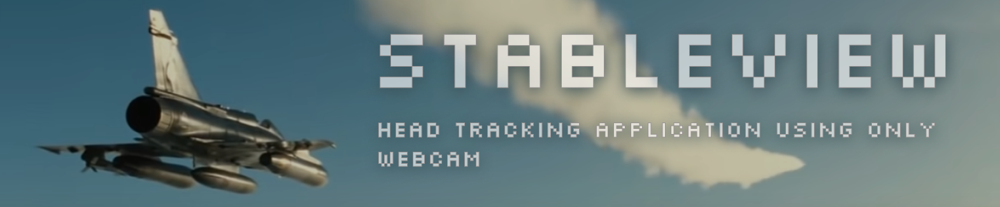

<p align="center"><a href="https://github.com/Shubhamai/StableView"></a></p>

<hr>

<p align="center"> Easy, fast and efficient Head Tracking application using only webcam  </p>

<p align="center">
<a href="https://github.com/shubhamai/StableView/releases/latest"></a> 
<a href="https://github.com/shubhamai/StableView/releases/latest"></a>
<a href="https://github.com/Shubhamai/StableView/actions/workflows/ci.yml"></a>
<a href="https://github.com/Shubhamai/StableView/actions/workflows/audit.yml"></a>
<a href="https://github.com/shubhamai/StableView/blob/main/LICENSE"></a>
<a href="https://github.com/shubhamai/StableView/releases/latest"></a>
</p>

<div align="center">
  <h3>
    <a href="https://github.com/shubhamai/StableView/releases/">
      Download
    </a>
    <span> | </span>
    <a href="https://github.com/shubhamai/StableView/wiki">
      Wiki
    </a>
    <span> | </span>
    <a href="https://github.com/Shubhamai/StableView/discussions">
      Chat
    </a>
    <span> | </span>
    <a href="https://github.com/Shubhamai/StableView/blob/main/CONTRIBUTING.md">
      Contributing
    </a>
  </h3>
</div>

<hr>

# Status

- The project is currently in heavy development and will have it's first alpha release soon :)
  - Todo's :
    - [ ] Release workflow.
    - [ ] Error handling & removing all `.expect` and `.unwrap`.
    - [ ] Saving app state & configuration management.
    - [ ] Adding custom design & styles to the UI.

# Installation

# Features

- Uses your regular old webcam with AI for head tracking.
- Uses extremely low CPU and returns high performance.
- Works with [opentrack](https://github.com/opentrack/opentrack) to run on any modern simulator including Microsoft Flight Simulator, Digital Combat Simulator, Xplane & more.
- Easy to install and _updates to newer versions with a click (in progress)_.

# Shoutouts

- Thanks to the authors of the paper [3DDFA_V2 : Towards Fast, Accurate and Stable 3D Dense Face Alignment](https://paperswithcode.com/paper/towards-fast-accurate-and-stable-3d-dense-1), without them, this application wouldn't have been possible, majority of the inference code is based on their work. Thanks [Jianzhu Guo](https://guojianzhu.com), [Xiangyu Zhu](http://www.cbsr.ia.ac.cn/users/xiangyuzhu/), [Yang Yang](http://www.cbsr.ia.ac.cn/users/yyang/main.htm), Fan Yang, [Zhen Lei](http://www.cbsr.ia.ac.cn/users/zlei/) and [Stan Z. Li](https://scholar.google.com/citations?user=Y-nyLGIAAAAJ).
- [Sniffer](https://github.com/GyulyVGC/sniffnet/) for GUI inspirations, code structure, readme, etc.
- [ChatGPT](https://openai.com/blog/chatgpt/) for assisting me to convert the python code to rust.

## Bug Report

If you see an error message or run into an issue, please [open a new issue](https://github.com/Shubhamai/StableView/issues/new/choose). This effort is valued and helps all the users.

## Feature Request

If you have any idea or a missing feature you would like to see, please [submit a feature request](https://github.com/Shubhamai/StableView/issues/new/choose) or [discuss](https://github.com/Shubhamai/StableView/discussions) it with other users.

## Contributing

Contributions are greatly appreciated! If you want to contribute to the project, please read [Contributing.md](CONTRIBUTING.md) for more details.

## Contributors

Thanks to all the people who contributed to the project.

<a href="https://github.com/shubhamai/StableView/graphs/contributors">
  
</a>

## License

StableView is open-source and free software released under the [MIT License](LICENSE).

## Citations

```bibtex
@inproceedings{guo2020towards,
    title =        {Towards Fast, Accurate and Stable 3D Dense Face Alignment},
    author =       {Guo, Jianzhu and Zhu, Xiangyu and Yang, Yang and Yang, Fan and Lei, Zhen and Li, Stan Z},
    booktitle =    {Proceedings of the European Conference on Computer Vision (ECCV)},
    year =         {2020}
}
```

```bibtex
@misc{3ddfa_cleardusk,
    author =       {Guo, Jianzhu and Zhu, Xiangyu and Lei, Zhen},
    title =        {3DDFA},
    howpublished = {\url{https://github.com/cleardusk/3DDFA}},
    year =         {2018}
}
```
